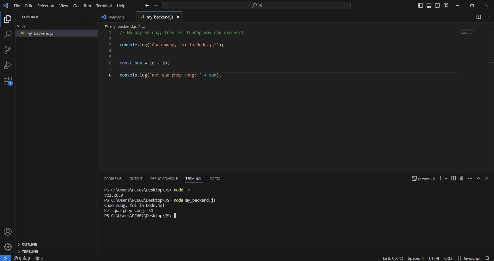

<style>
   .chia {
      display: flex;
      gap: 20px;
   }

   .cot {
      flex: 1;
   }
</style>>

# Chương 1. Nghề làm web

## 1.3. Bài tập và thực hành

### Bài 1. Liệt kê danh sách các ngôn ngữ lập trình, công cụ, kỹ năng, công nghệ mà bạn dự định học để theo nghề làm web.

- Ngôn ngữ lập trình: JavaScript, Python, Java.
- Công cụ: VSCode, GitHub, …
- Kỹ năng: Kiến thức nền về Hệ điều hành, Kỹ thuật lập trình, Cấu trúc dữ liệu và thuật toán, Lập trình hướng đối tượng, Cơ sở dữ liệu; Cơ bản về lập trình front-end và back-end, …

### Bài 2. Tự tạo một danh sách các thuật ngữ tiếng Anh chuyên ngành, kèm theo nghĩa tiếng Việt.

| Vocabulary                          | Nghĩa tiếng Việt                                                                 |
|--------------------------------------|------------------------------------------------------------------------------------|
| HTML (HyperText Markup Language)     | Ngôn ngữ đánh dấu siêu văn bản                                                     |
| CSS (Cascading Style Sheets)         | Bảng định kiểu xếp chồng                                                           |
| JavaScript                           | Ngôn ngữ lập trình kịch bản cho web                                                |
| Responsive Design                    | Thiết kế đáp ứng (tự động điều chỉnh giao diện trên các thiết bị khác nhau)       |
| User Interface (UI)                  | Giao diện người dùng                                                               |
| User Experience (UX)                 | Trải nghiệm người dùng                                                             |
| Wireframe                            | Khung phác thảo giao diện                                                          |
| Prototype                            | Mẫu thử giao diện                                                                  |
| Front-end                            | Phần giao diện người dùng của website                                              |
| Back-end                             | Phần xử lý phía máy chủ của website                                                |
| Framework                            | Khung phát triển ứng dụng                                                          |
| Content Management System (CMS)      | Hệ thống quản lý nội dung                                                          |
| Domain Name                          | Tên miền                                                                           |
| Hosting                              | Dịch vụ lưu trữ website                                                            |
| SEO (Search Engine Optimization)     | Tối ưu hóa công cụ tìm kiếm                                                        |
| Accessibility                        | Khả năng tiếp cận (đảm bảo website phù hợp với mọi đối tượng người dùng, kể cả người khuyết tật) |
| Bootstrap                            | Thư viện CSS phổ biến để thiết kế giao diện nhanh                                 |
| Grid System                          | Hệ thống lưới (định vị bố cục trang web)                                          |
| Media Query                          | Câu truy vấn đa phương tiện (CSS để điều chỉnh giao diện theo thiết bị)           |
| API (Application Programming Interface) | Giao diện lập trình ứng dụng                                                     |
| Debugging                            | Gỡ lỗi                                                                             |
| Cache                                | Bộ nhớ đệm                                                                         |
| Wireframe                            | Bản thiết kế khung sườn giao diện                                                  |
| Viewport                             | Khung nhìn trên trình duyệt                                                        |
| SSL Certificate                      | Chứng chỉ bảo mật SSL                                                              |
| Cross-browser Compatibility          | Tương thích giữa các trình duyệt                                                  |
| Typography                           | Nghệ thuật trình bày chữ viết                                                      |
| Parallax Scrolling                   | Hiệu ứng cuộn thị sai (các lớp nền di chuyển với tốc độ khác nhau)                |
| Favicon                              | Biểu tượng trang web trên tab trình duyệt                                          |
| Sitemap                              | Sơ đồ trang web                                                                    |

### Bài 3. Viết một CV cho bản thân, mục đích để biết bố cục một CV của người làm về công nghệ, biết được mình cần phải làm gì để có các nội dung ghi trong CV.

### Bài 4. Tạo một blog cho bản thân viết về các chủ đề bạn đang theo đuổi, có thể tạo trên blogspot, wordpress, github, hoặc trên các hệ thống khác.

<br> <br>

# Chương 2. Web là gì?

## 1.4. Bài tập và thực hành

### Bài 1. Tạo liên kết để mở một trang web trên hệ thống web.

[bai_tap1.html](Chuong2/bai_tap1.html)

### Bài 2. Phát triển từ bài tập 1, hãy tạo năm liên kết đến năm trang web mà bạn hay mở mỗi ngày. Thiết lập trang web này là trang mặc định, khi mở trình duyệt.

[](Image/2.1.png)

<div align="center">
<em>Thiết lập trang mặc định</em>
</div> <br>

Kết quả: [bai_tap2.html](Chuong2/bai_tap2.html)

## 1.5. Câu hỏi ôn tập

<div class="chia">
   <div class="cot">
<b>Câu 1. WWW là viết tắt của?</b> <br>
      <div class="chia">
         <div class="cot">
A. Wordl Wide Wed <br>
<mark>B. World Wide Web</mark> 
         </div>
         <div class="cot">
C. Word Wide Web <br>
D. Word Wibe Web 
         </div>
      </div> <br>

<b>Câu 2. URL là gì?</b> <br>
A. Một giao thức trong Internet <br>
B. Xác định tên của một máy tính trên mạng <br>
<mark>C. Định vị một tài nguyên cụ thể trên web</mark> <br>
D. Một chuẩn trong truyền dữ liệu trên web <br> <br>

<b>Câu 3. The Web is an information system where documents and other web resources are identified by Uniform Resource Locators (URLs, such as https://example.com/), which may be interlinked by ________, and are accessible over the Internet.</b> <br>
      <div class="chia">
<div class="cot"> A. URL </div>
<div class="cot"> B. pages </div>
<div class="cot"> C. computers </div>
<div class="cot"> <mark>D. hyperlinks</mark> </div>
      </div>
   </div>

   <div class="cot">
<b>Câu 4. HTML là viết tắt của?</b> <br>
      <div class="chia">
         <div class="cot">
A. HyperText Makeup Language <br>
B. HTTP Technology Model Language 
         </div>
         <div class="cot">
<mark>C. HyperText Markup Language</mark> <br>
D. HyperTest Makeup Language 
         </div>
      </div> <br>

<b>Câu 5. Trình duyệt web là một ứng dụng phần mềm để truy cập thông tin trên World Wide Web. Mỗi trang web, hình ảnh và video riêng lẻ được xác định bằng một _________ riêng biệt, cho phép các trình duyệt truy xuất và hiển thị chúng trên thiết bị của người dùng.</b> <br>
A. công nghệ <br>
B. mã HTML <br>
C. liên kết <br>
<mark>D. URL</mark> <br>

   </div>
</div> <br>
 
Giải thích: <br>

Câu 1: WWW là từ viết tắt của World Wide Web - Mạng lưới toàn cầu. <br>

Câu 2: URL là từ viết tắt của Uniform Resource Locator - Bộ định vị tài nguyên thống nhất nôm na là “Địa chỉ của một tài nguyên web”. <br>

Câu 3: Dịch sang tiếng việt nghĩa là “Web là một hệ thống thông tin nơi mà các tài liệu và các tài nguyên web khác được định danh bằng URL (ví dụ như  https://example.com/),có thể được liên kết với nhau bằng _____,  và có thể truy cập qua internet. Hyperlinks là siêu liên kết - một tham chiếu đến tài liệu hoặc tài nguyên web. <br>

Câu 4: HTML là từ viết tắt của Hypertext Markup Language - Ngôn ngữ đánh dấu siêu văn bản.

<br> <br>

# Chương 3. Trình duyệt Web

## Bài tập và thực hành

### Bài 1. Truy cập và sử dụng một số trang web, ghi lại các thông tin được hiển thị trên thanh trạng thái (nằm ở phía dưới cùng của cửa sổ trình duyệt). Mục đích: để giúp bạn quan sát được quá trình lấy mã nguồn trang web từ server về trình duyệt, và quan sát các liên kết có trong một trang web.

[](Image/3.1.png)

<div align="center">
<em>Có thể thấy được URL ở góc dưới bên trái khi rê chuột vào chữ “Wikipedia” ở tiêu đề</em>
</div>

### Bài 2. Tạo bookmark cho 5 trang web hữu ích đối với bạn.

[](Image/3.2.png)

<div align="center">
<em>Thiết lập Bookmark</em>
</div> <br>

[](Image/3.3.png)

<div align="center">
<em>Có thể thấy Bookmark với biểu tượng “cú Duolingo” với tên “2” đã xuất hiện trên Bookmark</em>
</div>

### Bài 3. Lưu đoạn mã nguồn của trang web sau vào một tập tin (test.html). Sau đó mở tập tin bằng trình duyệt. Sử dụng tab Elements của Developer tools, chỉ ra mã nguồn HTML, CSS và cây DOM của trang web.

[](Image/3.4.png)

Kết quả: [test.html](Chuong3/test.html)

## Câu hỏi ôn tập

<div class="chia">

   <div class="cot">
<b>Câu 1. Trình duyệt web đầu tiên do ai tạo ra?</b> <br>
      <div class="chia">
         <div class="cot">
A. Steve Jobs <br>
<mark>B. Tim Berners-Lee</mark>
         </div>
         <div class="cot">
C. Bill Gates <br>
D. Chrome 
         </div>
      </div> <br>

<b>Câu 2. Có thể sử dụng trình duyệt web để?</b> <br>
A. Xem nội dung trang web <br>
B. Hỗ trợ quá trình thiết kế giao diện <br>
C. Giúp tìm và sửa lỗi trong quá trình phát triển web <br>
<mark>D. Cả A, B, và C</mark> <br> <br>

<b>Câu 3. A web browser (commonly referred to as a browser or internet browser) is an _________ for accessing the World Wide Web.</b> <br>
      <div class="chia">
         <div class="cot">
<mark>A. application software</mark> <br>
B. operating system
         </div>
         <div class="cot">
C. library <br>
D. framework
         </div>
      </div>
   </div>

   <div class="cot">
<b>Câu 4. Mã nguồn trang web, khi trình duyệt nhận về từ web server có thể gồm?</b> <br>
      <div class="chia">
         <div style="flex: 1px;">
A. HTML, CSS, PHP, JavaScript <br>
B. HTML, CSS, C#
         </div>
         <div style="flex: 1px">
C. CSS, C#, SQL <br>
<mark>D. CSS, JavaScript, HTML</mark>
         </div>
      </div> <br>

<b>Câu 5. Một số kết quả trung gian được tạo ra khi trình duyệt hiển thị trang web là gì?</b> <br>
A. DOM, CSSOM, Trang web kết quả, HTML <br>
B. CSS, DOM, Trang web kết quả, DOM Tree <br>
<mark>C. DOM tree, CSSOM, Trang web kết quả, Render tree</mark> <br>
D. CSSOM, DOM tree, OOP, Render tree <br> <br>

<b>Câu 6. CSSOM là viết tắt của?</b> <br>
      <div class="chia">
         <div style="flex: 1px;">
A. CSS Object Modern <br>
B. CSS Oriented Model
         </div>
         <div style="flex: 1px;">
C. CSS Object Mode <br>
<mark>D. CSS Object Model</mark>
         </div>
      </div>
   </div>
</div> <br>

Giải thích: <br>

Câu 1: Ông tạo ra World Wide Web (sau đổi tên thành Nexus) năm 1990 – đây là trình duyệt web đầu tiên. <br>

Câu 3: Dịch sang tiếng việt nghĩa là “Một trình duyệt web (thường liên quan tới một trình duyệt hoặc trình duyệt internet) là một ____ để truy cập vào web.” Trình duyệt là phần mềm ứng dụng, không phải hệ điều hành hay framework. <br>

Câu 4: Trình duyệt nhận trực tiếp HTML, CSS, JavaScript còn PHP, C#, SQL chạy ở phía server, không gửi nguyên bản về cho client. <br>

Câu 5: Các bước của quá trình hiển thị: 
- Phân tích mã HTML để tạo cây DOM (DOM tree).
- Phân tích mã CSS để tạo CSSOM (CSS Object Model - mô hình đối tượng CSS).
- Kết hợp cây DOM và CSSOM để tạo ra cây kết xuất (Render tree).
- Dựng khung giao diện (layout) dựa trên cây kết xuất.
- Hiển thị nội dung lên trình duyệt (painting). <br>

Câu 6: CSSOM là từ viết tắt của CSS Object Model - Mô hình đối tượng.

<br> <br>

# Chương 4. URL, siêu liên kết và siêu văn bản

## 1.1.6. Bài tập và thực hành

### Bài 1. Quan sát một số URL trên mạng

[](Image/4.1.png)

<div align="center">
<em>Địa chỉ IP máy server của Wikipedia: 2001:df2:e500:ed1a::1</em>
</div> <br>

Di chuột vào các liên kết trên Main Page và ghi lại URL (trên thanh trạng thái – góc dưới trái): <br>
[https://en.wikipedia.org/wiki/Talk:Main_Page](https://en.wikipedia.org/wiki/Talk:Main_Page) <br>
[https://en.wikipedia.org/wiki/Main_Page](https://en.wikipedia.org/wiki/Main_Page) <br>
[https://en.wikipedia.org/w/index.php?title=Special:CreateAccount&returnto=Main+Page](https://en.wikipedia.org/w/index.php?title=Special:CreateAccount&returnto=Main+Page) <br>
[https://en.wikipedia.org/wiki/English_language](https://en.wikipedia.org/wiki/English_language) <br>
[https://en.wikipedia.org/wiki/Help:Introduction_to_Wikipedia](https://en.wikipedia.org/wiki/Help:Introduction_to_Wikipedia)

Trang Wikipedia vẫn hỗ trợ giao thức HTTP: [http://en.wikipedia.org:80/wiki/Main_Page](http://en.wikipedia.org:80/wiki/Main_Page)

Truy cập trang Tiki: [https://tiki.vn/search?q=loa%20m%C3%A1y%20t%C3%ADnh](https://tiki.vn/search?q=loa%20m%C3%A1y%20t%C3%ADnh) <br>
query_string (chuỗi truy vấn): bắt đầu sau dấu “?”: q=loa%20m%C3%A1y%20t%C3%ADnh

### Bài 2. Quan sát URL trên máy cục bộ.

Trên máy cục bộ, sử dụng phần mềm Notepad tạo một tập tin HTML có nội dung bất kỳ, ví dụ D:\index.html với nội dung là dòng chữ “Xin chao”

Mở tập tin index.html bằng trình duyệt, sẽ thấy dòng chữ “Xin chao” xuất hiện trên màn hình.

[index.html](Chuong4/index.html)

Tạo thư mục mới có tên là mywebsite, chuyển tập tin index.html vào trong thư mục vừa tạo, quan sát URL để hiểu thêm về đường dẫn thư mục. Ví dụ: file///D:/mywebsite/index.html

[](Image/4.2.png)

<div align="center">
<em>Có thể thấy trên đường dẫn đã xuất hiện chữ "D:"</em>
</div> <br>

### Bài 3. Tạo ra một siêu văn bản, có chứa 5 liên kết, để kết nối tới 5 trang web mà bạn yêu thích.

[baiTap3.html](Chuong4/baiTap3.html)

## 1.1.7. Câu hỏi ôn tập

<div class="chia">
   <div class="cot">
<b>Câu 1. A Uniform Resource Locator (URL) is a reference to a web resource that specifies its location on a computer network and a _______ for retrieving it.</b> <br>
      <div class="chia">
<div class="cot"> A. address </div>
<div class="cot"> B. channel </div>
<div class="cot"> C. format </div>
<div class="cot"><mark>D. mechanism</mark> </div>
      </div> <br>

<b>Câu 2. Các thành phần thường có trong một URL gồm?</b> <br>
A. schema, fragment_id, query_string, path, port, domain <br>
B. scheme, fragment_id, query_string, path, socket, domain <br>
<mark>C. scheme, fragment_id, query_string, path, port, domain</mark> <br>
D. scheme, fragment_id, query_language, path, port, domain <br> <br>

<b>Câu 3. Khi mở tập tin C:\index.html bằng trình duyệt, giao thức trình duyệt đã sử dụng trong URL là?</b> <br>
      <div class="chia">
<div class="cot"> A. http </div>
<div class="cot"> B. https </div>
<div class="cot"><mark>C. file</mark> </div>
<div class="cot"> D. ftp </div> <br>
      </div> <br>

<b>Câu 4. Khi mở tập tin C:\index.html bằng trình duyệt, tại sao lại có ba dấu xuyệt (///) liền nhau?</b> <br>
A. Là cú pháp để truy cập tập tin trên máy cục bộ <br>
<mark>B. Do lược bỏ tên của máy tính (localhost)</mark> <br>
C. Là chuẩn của giao thức FTP <br>
D. Là chuẩn của giao tiếp SSL
   </div>

   <div class="cot">
<b>Câu 5. In computing, a hyperlink, or simply a link, is a ___________ to data that the user can follow by clicking or tapping. A hyperlink points to a whole document or to a specific element within a document.</b> <br>
      <div class="chia">
<div class="cot"><mark>A. reference</mark> </div>
<div class="cot">B. format </div>
<div class="cot">C. following </div>
<div class="cot">D. calling </div>
      </div> <br>

<b>Câu 6. Hypertext is _______displayed on a computer display or other electronic devices with references (hyperlinks) to other text that the reader can immediately access. Hypertext documents are interconnected by hyperlinks, which are typically activated by a mouse click, keypress set, or screen touch. Apart from text, the term "hypertext" is also sometimes used to describe tables, images, and other presentational content formats with integrated hyperlinks.</b> <br>
      <div class="chia">
<div class="cot">A. link </div>
<div class="cot"><mark>B. text</mark> </div>
<div class="cot">C. format </div>
<div class="cot">D. web </div>
      </div>
   </div>
</div> <br>

Giải thích: <br>

Câu 1 (D): URL (Bộ định vị tài nguyên thống nhất) không chỉ chỉ định vị trí (location) của tài nguyên mà còn chỉ định cả cơ chế (mechanism) để truy xuất nó. Cơ chế đó chính là phần giao thức (scheme), ví dụ: http://, https://, ftp://, file://. <br>

Câu 2 (C): Đây là các thành phần chuẩn của một URL. Phương án B sai vì "socket" không phải là một thành phần của URL. Phương án D sai vì "query_language" không phải là thành phần chuẩn (đúng là "query_string"). <br>

Câu 3 (C): Khi trình duyệt mở một tập tin trực tiếp từ ổ cứng của máy tính (máy cục bộ), nó sẽ sử dụng giao thức file:// (File Transfer Protocol). Các giao thức http, https, ftp dùng để truy cập tài nguyên qua mạng. <br>

Câu 4 (B): Cú pháp đầy đủ của giao thức file là file://[tên_máy]/[đường_dẫn]. Khi truy cập file trên máy cục bộ, phần [tên_máy] (thường là localhost hoặc để trống) được lược bỏ, nên ta có file:// (phần giao thức) và / (bắt đầu đường dẫn tuyệt đối), gộp lại thành file:///. <br>

Câu 5 (A): Một siêu liên kết (hyperlink), hay đơn giản là một liên kết (link), về cơ bản là một tham chiếu (reference) đến dữ liệu (một tài liệu khác, một phần tử cụ thể) mà người dùng có thể truy cập bằng cách nhấp vào. <br>

Câu 6 (B): "Hypertext" (Siêu văn bản) chính là văn bản (text) được hiển thị trên máy tính có chứa các tham chiếu (siêu liên kết) tới văn bản khác. 

<br> <br>

# Chương 5. HTML_Tạo một trang web đơn giản

## 1.1.7. Bài tập và thực hành

### Bài 1. Viết lại các đoạn mã trong phần lý thuyết.

Bước 3. [Ngày đầu tiên đi học 1](Chuong5/NDTDH.html)

Bước 4. [Ngày đầu tiên đi học 2](Chuong5/NDTDH1.html) <br> <em>Mở mã nguồn để quan sát</em>

Bước 5. [index1.html](Chuong5/index1.html)

### Exercise 2. Entering content

Step 4. You should see some text on the screen. [index2.html](Chuong5/index2.html) 

### Exercise 3. Adding minimal structure

Step 5. Save the document in the bistro directory, so that it overwrites the old version. Open the file in the browser or hit Refresh or Reload if it is open already. [index3.html](Chuong5/index3.html)

### Exercise 4. Defining text elements

Step 6. Now that we’ve marked up the document, let’s save it as we did before, and open (or reload) the page in the browser. You should see a page that looks much like the one in the following figure. If it doesn’t, check your markup to be sure that you aren’t missing any angle brackets or a slash in a closing tag. [index4.html](Chuong5/index4.html)

## 1.1.8. Câu hỏi ôn tập

<div class="chia">
   <div class="cot">
<b>Câu 1. A static web page (sometimes called a flat page or a stationary page) is a web page that is delivered to the user's web browser exactly as stored, in contrast to __________ which are generated by a web application.</b> <br>
      <div class="chia">
         <div class="cot">
<mark>A. dynamic web pages</mark> <br>
B. web root
         </div>
         <div class="cot">
C. Internet <br>
D. database
         </div>
      </div> <br>

<b>Câu hỏi 2. Một phần tử HTML (thông thường) gồm các thành phần sau:</b> <br>
      <div class="chia">
         <div class="cot">
A. thẻ mở, thẻ đóng <br>
B. thẻ mở, nội dung
         </div>
         <div class="cot">
<mark>C. thẻ mở, nội dung, thẻ đóng</mark> <br>
D. thẻ đóng, nội dung
         </div>
      </div> <br>

<b>Câu hỏi 3. Cấu trúc cơ bản của một tài liệu HTML gồm:</b> <br>
<mark>A. Phần khai báo (doctype), phần tử html, phần tử head, phần tử title, phần tử body</mark> <br>
B. Phần khai báo (doctype), phần tử html, phần tử header, phần tử title, phần tử body <br>
C. Phần khai báo (doctype), phần tử html, phần tử head, phần tử link, phần tử body <br>
D. Phần khai báo (doctype), phần tử html, phần tử p, phần tử title, phần tử body <br>
   </div>

   <div class="cot">
<b>Câu hỏi 4. Phát biểu nào sau đây là hợp lý:</b> <br>
<mark>A. HTML tạo ra cấu trúc và ngữ nghĩa cho phần nội dung trang web</mark> <br>
B. HTML thực hiện việc trang trí cho trang web <br>
C. HTML xử lý các tương tác của người dùng trên giao diện web <br>
D. HTML vừa tạo ra phần nội dung vừa thực hiện trang trí cho trang web <br> <br>

<b>Câu hỏi 5. Phát biểu nào đúng khi nói về <code><!DOCTYPE html></code> ?</b> <br>
A. Là một thẻ HTML <br>
<mark>B. Là một khai báo trong tài liệu HTML</mark> <br>
C. Là một phần tử HTML <br>
D. Là một chú thích trong HTML <br>
   </div>
</div> <br>

Giải thích: <br>

Câu 1 (A): Trang web tĩnh (static) được gửi đến trình duyệt "y như nó được lưu" (chỉ là file HTML, CSS, JS). Ngược lại, trang web động (dynamic) được tạo ra bởi một ứng dụng web phía máy chủ (ví dụ: PHP, Java, Python) khi có yêu cầu, thường bằng cách lấy dữ liệu từ cơ sở dữ liệu. <br>

Câu 2 (C): Cấu trúc phổ biến và đầy đủ nhất của một phần tử HTML là: Thẻ mở (ví dụ: `<p>`), Nội dung (ví dụ: "Hello"), và Thẻ đóng (ví dụ: `</p>`). (Một số phần tử rỗng chỉ có thẻ mở như `` hoặc `<br>`). <br>

Câu 3 (A): Đây là cấu trúc cơ bản và tối thiểu của một tài liệu HTML5. header (B) là thẻ ngữ nghĩa nằm trong body. link (C) là tùy chọn, nằm trong head. p (D) là nội dung, nằm trong body. <br>

Câu 4 (A): Vai trò chính của HTML là cung cấp cấu trúc (ví dụ: đây là tiêu đề, đây là đoạn văn) và ngữ nghĩa (semantic) cho nội dung. Việc trang trí (B, D) là của CSS. Việc xử lý tương tác (C) là của JavaScript. <br>

Câu 5 (B): `<!DOCTYPE html>` không phải là một thẻ hay phần tử HTML (nó không có thẻ đóng và không thuộc cây DOM). Nó là một khai báo (declaration) bắt buộc ở đầu file, cho trình duyệt biết rằng đây là tài liệu HTML5 và cần được hiển thị theo chế độ chuẩn (standards mode). 

<br> <br>

# Chương 6. HTML_Hoàn thiện trang web đơn giản

## 1.1.7. Bài tập thực hành

### Bài 1. Viết lại các đoạn mã trong phần lý thuyết.

#### 1.1.1. Phần tử rỗng

Ví dụ, đoạn mã HTML dưới đây, sẽ sử dụng thẻ `<br>` để ngắt hàng và thẻ `<hr>` để tạo một đường kẻ ngang.

[Ngày đầu tiên đi học](Chuong6/NDTDH.html)

#### 1.1.2. Thuộc tính

- Chuẩn bị sẵn một tập tin hình ảnh (.jpg, .png, .jpeg, .gif), để trong cùng thư mục với tập tin index.html. Ví dụ tập tin hình ảnh có tên là con-vit.png.

- Mở tập tin index.html bằng Notepad

- Chèn thêm dòng mã này vào ngay sau thẻ `<body>`: 

``

Khi đó, nội dung của index.html sẽ như sau:

[index.html](Chuong6/Convit/index.html)

#### 1.1.3. Hiển thị tiếng Việt

Để khai báo bộ mã hóa kí tự cho trang web, trong phần tử head thêm dòng mã sau:

`<meta charset="utf-8">`

Mở tập tin index.html bằng Notepad, nhập lại đoạn thơ có dấu tiếng Việt, khi lưu, trong mục Encoding nhớ chọn là UTF-8. Mở trang web bằng trình duyệt, sẽ thấy đoạn thơ đã có dấu tiếng Việt.

[index1.html](Chuong6/Convit/index1.html)

#### 1.1.4. Thêm CSS cho trang web

Phần này bạn sẽ thực hiện viết thêm một đoạn mã trang trí và định dạng cho trang web, theo hướng dẫn sau (đây chỉ là một trong nhiều cách để viết CSS).

Trong phần tử head, tạo thêm phần tử style, sau đó viết các chỉ dẫn định dạng (style rule): Ví dụ: [index2.html](Chuong6/Convit/index2.html)

### Exercise 2. Adding an image

Step 1. If you’re working along, the first thing you’ll need to do is get a copy of the image file on your hard drive so you can see it in place when you open the file locally. <br> 
You can get the image file by saving it right from the sample web page online at learningwebdesign.com/5e/materials/ch04/bistro. Right-click (or Control-click on a Mac) the goose image and select “Save to disk” (or similar) from the pop-up menu.<br> 
Name the file blackgoose.png. Be sure to save it in the bistro folder with index.html.

Step 2. Once you have the image, insert it at the beginning of the first-level heading by typing in the img element and its attributes as shown here: <br>
`<h1>Black Goose Bistro</h1>` <br>
For example: [index.html](Chuong6/Blackgoose/index.html)

### Exercise 3. Adding a style sheet

Step 1. Open index.html if it isn’t open already. We’re going to use the style element to apply a very simple embedded style sheet to the page. This is just one of the ways to add a style sheet; <br>

Step 2. The style element is placed inside the document head. Start by adding the style element to the document as shown here: <br>

```
<head>

<meta charset="utf-8">

<title>Black Goose Bistro</title>

<style>

 

</style>

</head>
</code></pre>
```

Step 3. Next, type the following style rules within the style element just as you see them here. Don’t worry if you don’t know exactly what’s going on (although it’s fairly intuitive). You’ll learn all about style rules later. <br>

```
<style>

body {

   background-color: #faf2e4;

   margin: 0 10%;

   font-family: sans-serif;

}

h1 {

   text-align: center;

   font-family: serif;

   font-weight: normal;

   text-transform: uppercase;

   border-bottom: 1px solid #57b1dc;

   margin-top: 30px;

}

h2 {

   color: #d1633c;

   font-size: 1em;

}

</style>
```

Step 4. Now it’s time to save the file and take a look at it in the browser. It should look like the page in the following picture. If it doesn’t, go over the style sheet to make sure you didn’t miss a semicolon or a curly bracket. Look at the way the page looks with our styles compared to the browser’s default styles. <br>

[index1.html](Chuong6/Blackgoose/index1.html)

### Bài 4. Như đã biết, phần tử head chứa các thông tin mô tả cho trang web, ví dụ tiêu đề (title), từ khóa, tác giả; tập tin định dạng (CSS), đoạn mã JavaScript, các thông tin này không được hiển thị ra cửa sổ trình duyệt, còn phần body chứa toàn bộ nội dung mà chúng ta muốn hiển thị ra cửa sổ trình duyệt. Bài tập này sẽ thêm một số thông tin mô tả cho tài liệu HTML.

## 1.1.8. Câu hỏi ôn tập

<div class="chia">
   <div class="cot">
<b>Câu 1. Trong UTF-8, UTF là viết tắt của các từ nào?</b> <br>
      <div class="chia">
         <div class="cot">
A. Uniform Text Format <br>
<mark>B. Unicode Transformation Format</mark>
         </div>
         <div class="cot">
C. Uniform Transformation Format <br>
D. Unicode Text Format
         </div>
      </div> <br>

<b>Câu 2. Metadata is "data that provides ________about other data". In other words, it is "data about data".</b> <br>
      <div class="chia">
<div class="cot">A. format </div>
<div class="cot"><mark>B. information</mark> </div>
<div class="cot">C. structure </div>
<div class="cot">D. standard </div>
      </div> <br>

<b>Câu 3. Technically, an ________is the collection of start tag, its attributes, an end tag and everything in between. On the other hand an HTML tag (either opening or closing) is used to mark the start or end of an element.</b> <br>
      <div class="chia">
         <div class="cot">
A. HTML attribute <br>
B. HTML tag
         </div>
         <div class="cot">
C. HTML document <br>
<mark>D. HTML element</mark>
         </div>
      </div>
   </div>
   
   <div class="cot">
<b>Câu 4. Indicate whether each of these filenames is not an acceptable name for a web document.</b> <br>
      <div class="chia">
         <div class="cot">
A. Sunflower.html <br>
B. index.htm
         </div>
         <div class="cot">
C. Song_Lyrics.html <br>
<mark>D. cooking home page.html</mark>
         </div>
      </div> <br>

<b>Câu 5. One of the following markup examples is incorrect. Which one?</b> <br>
A. &lt;img src = "birthday.jpg"&gt; <br>
<mark>B. &lt;em&gt;Congratulations!&lt;em&gt;</mark> <br>
C. &lt;a href="file.html"&gt;linked text&lt;/a&gt; <br>
D. &lt;p&gt;This is a new paragraph&lt;/p&gt; <br> <br>

<b>Câu 6. Trang web [https://validator.w3.org/](https://validator.w3.org/) dùng để làm gì?</b> <br>
A. Để hiển thị tài liệu của W3C <br>
B. Để chạy mã nguồn HTML và cho ra kết quả <br>
<mark>C. Để kiểm tra tính hợp lệ của mã HTML</mark> <br>
D. Để đăng ký tên miền cho trang web <br>
   </div>
</div> <br>

Giải thích: <br>

Câu 1 (B): UTF là viết tắt của Unicode Transformation Format (Định dạng Chuyển đổi Unicode). UTF-8 là một cách mã hóa (encoding) cụ thể của tiêu chuẩn Unicode, sử dụng 8-bit. <br>

Câu 2 (B): Metadata là "dữ liệu về dữ liệu" (data about data). Nó cung cấp thông tin (information) mô tả về dữ liệu chính của trang (ví dụ: tác giả, bộ ký tự, từ khóa). <br>

Câu 3 (D): Một phần tử HTML (HTML element) là một khái niệm hoàn chỉnh, bao gồm thẻ mở, thuộc tính, nội dung, và thẻ đóng. Một thẻ HTML (HTML tag) chỉ là phần đánh dấu (`<p>` hoặc `</p>`). <br>

Câu 4 (D): Không nên sử dụng dấu cách (space) trong tên tệp cho web ("cooking home page.html"). Dấu cách không hợp lệ trong URL và sẽ phải mã hóa thành %20, gây khó khăn và tiềm ẩn lỗi. Các phương án A, B, C đều là các cách đặt tên hợp lệ. <br>

Câu 5 (B): Lỗi. Thẻ đóng của `<em>` phải là `</em>` (có dấu gạch chéo /). Các ví dụ A, C, D đều đúng cú pháp. <br>

Câu 6 (C): Trang web validator.w3.org là dịch vụ chính thức của W3C (World Wide Web Consortium) dùng để kiểm tra tính hợp lệ của mã HTML (validate), giúp tìm các lỗi cú pháp và đảm bảo mã tuân thủ các tiêu chuẩn web. 

<br> <br>

# Chương 7. HTML - Hiển thị văn bản

## 1.1.5. Bài tập thực hành

### Bài 1. Viết lại các đoạn mã trong phần lý thuyết 

#### 1.1.1. Đoạn văn và đề mục

##### Đề mục

Một văn bản không chỉ có các đoạn, hình ảnh, mà còn có hệ thống đề mục (hay hệ thống tiêu đề).

Đề mục (heading) là một từ, cụm từ, hoặc kí hiệu, giúp người đọc có thể tìm kiếm và định vị được thông tin.

Hệ thống đề mục thường gồm nhiều cấp khác nhau, thể hiện cấu trúc, bố cục, hay bộ khung (outline) của một văn bản. Để dễ hiểu, hãy liên tưởng tới hệ thống heading trong Microsoft Word.

Trong thực tế, nên sử dụng phần tử h1 cho đề mục mức cao nhất, sau đó tùy theo nội dung văn bản để sử dụng các đề mục mức thấp hơn. 

Ví dụ: [Đề mục](Chuong7/DeMuc.html)

##### Đánh dấu kết thúc một chủ đề

Để đánh dấu kết thúc một chủ đề/ý tưởng và chuyển sang chủ đề/ý tưởng khác, sử dụng phần tử hr, phần tử này sẽ tạo một đường kẻ ngang (horizontal rule) giữa hai chủ đề/ý tưởng.

Nếu bạn chỉ muốn tạo một đường kẻ ngang trên trang web thì bạn sẽ dùng border trong CSS chứ không nên sử dụng phần tử hr.

Ví dụ: [Đánh dấu kết thúc một chủ đề](Chuong7/MarkDEOATopic.html)

#### 1.1.2. Danh sách

##### Danh sách không có thứ tự

Danh sách không có thứ tự là một dãy các mục (item), trong đó tính trước sau của mỗi mục là không quan trọng. Mỗi mục thường được trình duyệt đánh dấu bằng một kí tự đầu dòng (dấu đầu dòng) (bullet). Trong thực tế, phần lớn các danh sách sẽ thuộc loại này.

Để tạo danh sách không có thứ tự, sử dụng phần tử ul, viết tắt của unordered list (danh sách không có thứ tự).

Để tạo mỗi mục của danh sách, sử dụng phần tử li, viết tắt của list item (mục của danh sách).

Ví dụ: [Danh sách không có thứ tự](Chuong7/UnorderedList.html)

##### Danh sách có thứ tự

Danh sách có thứ tự là một dãy các mục, trong đó tính trước sau của mỗi mục là quan trọng, ví dụ, danh sách các bước hướng dẫn để làm một công việc. Để thể hiện tính thứ tự của các mục, trình duyệt sẽ tự động sử dụng các số hoặc các chữ cái để gắn vào phía trước mỗi mục, giá trị của các số/chữ sẽ được tự động tăng cùng với các mục.

Để tạo danh sách có thứ tự, sử dụng phần tử ol, viết tắt của ordered list (danh sách có thứ tự).

Để tạo mỗi mục của danh sách, sử dụng phần tử li, viết tắt của list item (phần tử của danh sách).

Ví dụ: [Danh sách có thứ tự](Chuong7/OrderedList.html)

##### Thay đổi giá trị bắt đầu

Với danh sách có thứ tự, giá trị bắt đầu luôn là 1, I, i, A hoặc a. Để thay đổi giá trị bắt đầu, sử dụng thuộc tính start.

Ví dụ: [Thay đổi giá trị bắt đầu của DSCTT](Chuong7/ChangeStartingValue.html)

##### Danh sách mô tả

Danh sách mô tả (description list, definition list) là loại danh sách được sử dụng để biểu diễn dữ liệu theo kiểu từng cặp tên/giá trị (name/value), ví dụ: tên thuật ngữ/mô tả, câu hỏi/đáp án.

Ví dụ: [Danh sách mô tả](Chuong7/DesList.html)

##### Danh sách lồng nhau

Một danh sách có thể chứa danh sách khác, miễn là danh sách con phải được đặt trong phần tử li của danh sách cha.

Ví dụ: [Danh sách lồng nhau](Chuong7/NestedList.html)

#### 1.1.3. Một số phần tử hiển thị nội dung khác

##### Hiển thị một trích dẫn dài (long quotation)

Để đánh dấu và hiển thị phần nội dung được trích dẫn dài (trích dẫn gồm nhiều hàng) từ nguồn khác, lời nhận xét của khách hàng (testimonial), và phần sao chép từ nguồn khác, bạn sẽ sử dụng phần tử blockquote. Nội dung bên trong phần tử blockquote nên được bọc lại bằng các phần tử HTML khác như p, heading, ol, ul, dl.

Ví dụ: [Trích dẫn dài](Chuong7/LongQuotation.html)

##### Hiển thị văn bản được định dạng sẵn

Như đã biết, khi biên dịch mã HTML để hiển thị, trình duyệt sẽ bỏ qua các khoảng trắng và các kí tự xuống hàng dư thừa. Vì vậy, với một số văn bản mà nhất thiết phải giữ các khoảng trắng, và các kí tự xuống hàng, ví dụ như một đoạn mã chương trình, một bài thơ, thì hãy sử dụng phần tử pre.

Khi gặp phần tử pre, trình duyệt sẽ hiển thị ra đúng những gì đang có ở dạng mã nguồn, cả nội dung và hình thức trình bày, nghĩa là giữ nguyên tất cả các khoảng trắng và các kí tự xuống hàng. Phần tử pre thuộc kiểu hiển thị khối, phông chữ mặc định được sử dụng là loại phông mà các kí tự có độ rộng bằng nhau, thường được gọi là monospace (ví dụ Courier). Pre là viết tắt của preformatted text.

Ví dụ: [Văn bản được định dạng sẵn](Chuong7/PreText.html)

##### Phần tử figure và figcapion

Phần tử figure là phần tử hiển thị kiểu khối, nó có thể chứa hình ảnh, đoạn mã, video, bảng, hoặc các loại dữ liệu khác, dùng để minh họa thêm cho nội dung được đề cập trong văn bản. Ví dụ sau khi trình bày về “cấu trúc của một tài liệu HTML gồm những thành phần nào”, để dễ hiểu bạn sẽ dùng phần tử figure để chèn thêm một cái hình, minh họa về cấu trúc của một tài liệu HTML. 

Nếu cần thêm chú thích cho: hình ảnh, đoạn mã, video hoặc bảng, nằm trong phần tử figure thì sử dụng phần tử figcaption. Phần tử figcaption có thể nằm trước hoặc sau phần nội dung mà nó chú thích. Caption có nghĩa là chú thích (từ comment cũng có nghĩa là chú thích, nhưng là chú thích cho đoạn mã). Từ figure có nghĩa là hình ảnh, hình minh họa (thường được đánh số) trong các cuốn sách. Ví dụ, xem minh họa trong hình 10 (figure 10).

Ví dụ: [Figure và Figcaption](Chuong7/FigureNFigcaption.html)

### Bài 2. Sử dụng ul/li hoặc ol/li để tạo menu như hình dưới đây (khung màu xanh).

[](Image/7.1.jpg)

[Menu.html](Chuong7/Menu.html)

### Bài 3. Tạo breadcrumbs như hình sau.

[](Image/7.2.png)

[Breadcrumbs.html](Chuong7/BreadCrumbs.html)

### Exercise 4. Marking up a recipe

The owners of the Black Goose Bistro have decided to share recipes and news on their site. In the exercises in this chapter, we’ll assist them with content markup. In this exercise, you will find the raw text of a recipe. It’s up to you to decide which element is the best semantic match for each chunk of content. You’ll use paragraphs, headings, lists, and at least one special content element.

[Tapenade Recipe](Chuong7/TapenadeRecipe.html)

## 1.1.6. Câu hỏi ôn tập

<div class="chia">
   <div class="cot">
<b>Câu hỏi 1. Trong HTML, chữ "hr" trong phần tử hr là viết tắt của chữ nào ?</b> <br>
      <div class="chia">
         <div class="cot">
A. Horizontal Ruler <br>
B. Header
         </div>
         <div class="cot">
C. Heading ruler <br>
<mark>D. Horizontal Rule</mark>
         </div>
      </div> <br>

<b>Câu hỏi 2. Trong HTML, chữ “pre” trong phần tử pre là viết tắt của chữ nào?</b> <br>
      <div class="chia">
         <div class="cot">
A. Preferred text <br>
<mark>B. Preformatted text</mark>
         </div>
         <div class="cot">
C. Previous text <br>
D. Part reference
         </div>
      </div> <br>

<b>Câu hỏi 3. Trong HTML, chữ ‘dl” trong phần tử dl là viết tắt của chữ nào?</b> <br>
      <div class="chia">
         <div class="cot">
A. Document list <br>
B. Data list
         </div>
         <div class="cot">
<mark>C. Description list</mark> <br>
D. Data link
         </div>
      </div>
   </div>
   
   <div style="flex: 1px;">
<b>Câu hỏi 4. Trong HTML, chữ ‘ul” trong phần tử ul là viết tắt của chữ nào?</b> <br>
      <div class="chia">
         <div class="cot">
<mark>A. unordered list</mark> <br>
B. unorder list
         </div>
         <div class="cot">
C. unordered line <br>
D. under list
         </div>
      </div> <br>

<b>Câu hỏi 5. Trong HTML, chữ ‘ol” trong phần tử ol là viết tắt của chữ nào?</b> <br>
      <div class="chia">
         <div class="cot">
A. over list <br>
B. over line
         </div>
         <div class="cot">
<mark>C. ordered list</mark> <br>
D. order list
         </div>
      </div>
   </div>
</div> <br>

Giải thích: <br>

Câu 1 (D): hr là viết tắt của Horizontal Rule (Đường kẻ ngang). Trong HTML5, nó mang ý nghĩa là một sự ngắt quãng về chủ đề (thematic break), và được trình duyệt mặc định hiển thị là một đường kẻ ngang. <br>

Câu 2 (B): pre là viết tắt của Preformatted text (Văn bản được định dạng trước). Nội dung bên trong thẻ `<pre>` sẽ giữ nguyên mọi khoảng trắng, tab, và ký tự xuống dòng y như trong mã nguồn. <br>

Câu 3 (C): dl là viết tắt của Description list (Danh sách mô tả). Nó được dùng để chứa các cặp `<dt>` (description term - thuật ngữ) và `<dd>` (description details - mô tả). <br>

Câu 4 (A): ul là viết tắt của Unordered list (Danh sách không có thứ tự), thường được hiển thị dưới dạng các dấu đầu dòng (bullet). <br>

Câu 5 (C): ol là viết tắt của Ordered list (Danh sách có thứ tự), thường được hiển thị dưới dạng số (1, 2, 3...) hoặc chữ cái (a, b, c...). <br>

<br> <br>

# Chương 8. HTML - Bố cục trang web

## 1.1.3. Bài tập và thực hành

### Bài 1. Viết lại các đoạn mã trong phần lý thuyết.

#### Vùng nội dung chính (main content)

Trong một website, nội dung các vùng tiêu đề (masthead, header), khung nội dung bổ trợ (sidebar), vùng quảng cáo (ads), và vùng cuối/chân trang (footer) thường xuất hiện nhiều lần, trong nhiều trang web (web page). Riêng vùng nội dung chính (main) chỉ xuất hiện một lần.

Ví dụ: [Main](Chuong8/Main.html)

#### Phần đầu (headers)

Phần tử header thường dùng để chứa nội dung giới thiệu, tuy nhiên, trong thực tế nó có thể chứa mọi thứ, miễn là liên quan đến mục đích giới thiệu, ví dụ logo, tiêu đề, khẩu hiệu, thanh điều hướng. Phần tử này thường được đặt ở đầu của trang web, hoặc phía trên cùng của một vùng (section) hoặc một bài viết (article).

Ví dụ: [Header](Chuong8/Header.html)

#### Phần chân (footers)

Phần tử footer dùng để chứa các thông tin ở cuối một trang web, cuối một vùng (section) hoặc cuối một bài viết (article). Phần tử footer thường chứa tên tác giả, thông tin bản quyền (copyright), các tài liệu liên quan, hoặc các điều hướng (navigation).

Ví dụ: [Footer](Chuong8/Footer.html)

#### Phân vùng (section)

Phần tử section dùng để chia nội dung thành các vùng theo các chủ đề khác nhau. Mỗi phần tử section thường bao gồm heading (h1-h6) và phần nội dung. Có thể hiểu nôm na, phần tử section được sử dụng để liệt kê nội dung, giống như vai trò liệt kê các mục trong danh sách của phần tử li.

Ví dụ: [Section 1](Chuong8/Section1.html) <br>
Ví dụ khác: [Section 2](Chuong8/Section2.html) <br>
Ví dụ khác: [Section 3](Chuong8/Section3.html) 

#### Bài viết (article)

Phần tử article cũng có chức năng chia nội dung thành các vùng như phần tử section, tuy nhiên, có một điều khác là phần nội dung nằm trong phần tử article có thể tồn tại độc lập (không liên quan đến các nội dung khác), và có thể được sử dụng lại ở nơi khác. Ngay tên của phần tử đã phản ánh tính chất của nó, article là một bài viết.

Ví dụ: [Article](Chuong8/Article.html)

#### Bài viết gồm nhiều phần (article chứa section)

Nếu một article gồm nhiều nội dung, có thể chia nội dung thành các section.

Ví dụ: [Article chứa Section](Chuong8/ArticleSrrdSection.html)

#### Một vùng chứa nhiều bài viết (section chứa article)

Ngược lại, một section cũng có thể chứa nhiều article.

Ví dụ: [Section chứa Article](Chuong8/SectionSrrdArticle.html)

#### Thông tin bổ trợ (aside)

Phần tử aside được sử dụng để chứa các thông tin có liên quan đến nội dung chính, được đặt bên cạnh nội dung chính (trên, dưới, trái, phải). Aside có nghĩa là bổ sung thêm. Về mặt trực quan có thể hình dung phần tử aside giống với sidebar (thanh bên) trên giao diện web, tuy nhiên, hai cái này không phải là một. Aside mang tính bổ trợ về mặt ngữ nghĩa, trong khi sidebar có nghĩa là đặt ở bên cạnh khi hiển thị.

Ví dụ: [Aside](Chuong8/Aside.html)

#### Điều hướng (navigation)

Phần tử nav được sử dụng để chứa các liên kết (link) điều hướng, thường được sử dụng để tạo trình đơn (menu) ngang, dọc. Lưu ý, không phải mọi liên kết đều phải đặt trong phần từ nav. Nav là viết rút gọn của navigation.

Ví dụ: [Navigation](Chuong8/Navigation.html)

#### Thông tin liên hệ (address)

Phần tử address được sử dụng để chứa các thông tin liên lạc với tác giả của bài viết hoặc người đăng bài viết. Phần tử này thường được để ở cuối của tài liệu, cuối vùng hoặc cuối bài viết. Phần tử address nên đặt trong phần tử footer.

Ví dụ: [Address](Chuong8/Address.html)

### Bài 2. Sử dụng các phần tử HTML đã học để tạo phần nội dung của một trang báo. Ví dụ, tuoitre.vn.

[Trang báo](Chuong8/TrangBao.html)

### Bài 3. Sử dụng các phần tử HTML đã học, để tạo phần nội dung của một trang dạy về công nghệ. Ví dụ, https://www.w3schools.com/html/default.asp

[Trang nội dung dạy về công nghệ](Chuong8/W3School.html)

## 1.1.4. Câu hỏi ôn tập

<div class="chia">
   <div class="cot">
<b>Question 1. The content inside the ______ element should be unique to the document. It should not contain any content that is repeated across documents such as sidebars, navigation links, copyright information, site logos, and search forms.</b> <br>
      <div class="chia">
<div class="cot"><mark>A. main</mark> </div>
<div class="cot">B. article </div>
<div class="cot">C. section </div>
<div class="cot">D. header </div>
      </div> <br>

<b>Question 2. The ______ element represents a container for introductory content or a set of navigational links.</b> <br>
      <div class="chia">
<div class="cot">A. head </div>
<div class="cot">B. footer </div>
<div class="cot"><mark>C. header</mark> </div>
<div class="cot">D. article </div>
      </div> <br>

<b>CQuestion 3. The _______ element represents a self-contained composition in a document, page, application, or site, which is intended to be independently distributable or reusable (e.g., in syndication).</b> <br>
      <div class="chia">
<div class="cot">A. aside </div>
<div class="cot">B. main </div>
<div class="cot">C. section </div>
<div class="cot"><mark>D. article</mark> </div>
      </div>
   </div>
   
   <div class="cot">
<b>Question 4. The ______  element identifies content that is separate from, but tangentially related to, the surrounding content. In print, its equivalent is a sidebar, but it couldn’t be called “sidebar” because putting something on the “side” is a presentational description, not semantic.</b> <br>
      <div class="chia">
<div class="cot">A. main </div>
<div class="cot"><mark>B. aside</mark> </div>
<div class="cot">C. section </div>
<div class="cot">D. article </div>
      </div> <br>

<b>Question 5. The ______ element is used to create an area for contact information for the author or maintainer of the document. It is generally placed at the end of the document or in a section or article within a document.</b> <br>
      <div class="chia">
<div class="cot">A. footer </div>
<div class="cot">B. header </div>
<div class="cot">C. aside </div>
<div class="cot"><mark>D. address</mark> </div>
      </div>
   </div>
</div> <br>

Giải thích: <br>

Câu 1 (A): Thẻ `<main>` được thiết kế để chứa nội dung chính, độc nhất của trang. Các phần như sidebar, navigation, footer thường được lặp lại trên nhiều trang nên không đặt trong `<main>`. <br>

Câu 2 (C): Thẻ `<header>` dùng để chứa nội dung giới thiệu hoặc điều hướng, thường đặt ở đầu trang hoặc đầu một `<article>`/`<section>`. (Lưu ý không nhầm với thẻ `<head>` chứa metadata). <br>

Câu 3 (D): Thẻ `<article>` định nghĩa một nội dung độc lập, khép kín (self-contained) có thể được phân phối hoặc tái sử dụng ở nơi khác (ví dụ: một bài đăng blog, một tin tức, một bình luận). <br>

Câu 4 (B): Thẻ `<aside>` dùng cho nội dung liên quan bên lề, không thuộc luồng nội dung chính (ví dụ: sidebar, các liên kết liên quan, quảng cáo). <br>

Câu 5 (D): Thẻ `<address>` được dùng với mục đích ngữ nghĩa là cung cấp thông tin liên hệ (tác giả, chủ sở hữu) cho tài liệu hoặc bài viết (article) gần nhất. <br>

<br> <br>

# Chương 9. HTML - Form

## 1.1.3. Bài tập và thực hành

### Bài 1. Viết lại các đoạn mã trong phần lý thuyết.

#### Phần tử label

Khi quan sát một ô nhập liệu trên trình duyệt, ví dụ ô nhập họ tên, chúng ta sẽ thấy chữ “Họ tên” và ô nhập liệu nằm cạnh nhau. Tuy nhiên, trong mã nguồn, đây là hai phần tử riêng biệt. Trong đó, label chứa phần văn bản để mô tả ngữ nghĩa cho một control khác.

Mỗi label được kết hợp với duy nhất một control, việc kết hợp này có thể thực hiện bằng hai cách.

- Cách một, kết hợp ngầm (implicit association) bằng cách đặt control và mô tả của nó trong phần tử label. Ví dụ: [Kết hợp ngầm trong label](Chuong9/Label1.html)

- Cách hai, kết hợp tường minh (explicit association), sử dụng thuộc tính for của label để tham chiếu tới id của control. Cách này có ưu điểm là tách biệt hai phần tử label và input, giúp dễ dàng thực hiện căn chỉnh, định dạng bằng CSS. Ví dụ: [Kết hợp tường minh trong label](Chuong9/Label2.html)

#### Phần tử fieldset và legend

Phần tử fieldset được sử dụng để nhóm các control có liên quan đến nhau, để chú thích cho nhóm các control này sử dụng phần tử legend. Ví dụ: [Fieldset và Legend](Chuong9/FieldsetNLegend.html)

### Exercise 2. Here’s the scenario. You are the web designer in charge of creating an online pizza ordering form for Black Goose Bistro. The owner has handed you a sketch (see the below figure) of the form’s content. There are sticky notes from the programmer with information about the script and variable names you need to use.

[](Image/9.1.jpg)

[Result at here](Chuong9/Ex2.html)

### Bài 3. Viết mã cho form sau:

[](Image/9.2.png)

[Kết quả](Chuong9/Ex3.html)

## 1.1.5. Câu hỏi ôn tập

<div class="chia">
   <div class="cot">
<b>Câu 1. A webform, web form or HTML form on a web page allows a user to _____ that is sent to a server for processing.</b>
      <div class="chia">
         <div class="cot">
A. download data <br>
B. create database
         </div>
         <div class="cot">
C. markup database <br>
<mark>D. enter data</mark>
         </div>
      </div> <br>

<b>Câu 2. Trong quá trình mua hàng online, để người mua hàng lựa chọn hình thức thanh toán (trả tiền mặt khi nhận hàng, chuyển khoản, MoMo...v.v), sử dụng control nào là hợp lý nhất?</b>
      <div class="chia">
<div class="cot">A. Checkbox</div>
<div class="cot"><mark>B. Radio</mark></div>
<div class="cot">C. Textarea</div>
<div class="cot">D. Button</div>
      </div> <br>

<b>Câu 3. Khi muốn lấy ý kiến đánh giá, bình luận về một sản phẩm từ người mua hàng, sử dụng control nào là hợp lý nhất?</b>
      <div class="chia">
<div class="cot">A. Datalist</div>
<div class="cot">B. Label</div>
<div class="cot">C. Select</div>
<div class="cot"><mark>D. Textarea</mark></div>
      </div>
   </div>

   <div class="cot">
<b>Câu 4. Khi làm việc với form, để không bị chuyển trang khi bấm nút submit, bạn có thể thiết lập giá trị cho action là:</b>
      <div class="chia">
<div class="cot">A. %</div>
<div class="cot"><mark>B. #</mark></div>
<div class="cot">C. @</div>
<div class="cot">D. /</div>
      </div> <br>

<b>Câu 5. Trong form có chứa control `<input type="password" name="mat-khau" maxlength="8" id="form-mat-khau">`. Vậy, khi gửi form này về web server, mật khẩu của người dùng sẽ chứa trong thuộc tính nào?</b>
      <div class="chia">
<div class="cot">A. type</div>
<div class="cot"><mark>B. name</mark></div>
<div class="cot">C. maxlength</div>
<div class="cot">D. id</div>
      </div> <br>

<b>Câu 6. Phần tử fieldset được sử dụng để nhóm các control có liên quan đến nhau, để chú thích cho nhóm các control này sử dụng phần tử _____.</b>
      <div class="chia">
<div class="cot">A. label</div>
<div class="cot">B. group</div>
<div class="cot">C. textarea</div>
<div class="cot"><mark>D. legend</mark></div>
      </div>
   </div>
</div> <br>

Giải thích: <br>

Câu 1 (D): Chức năng chính của một biểu mẫu (form) trên web là cho phép người dùng nhập dữ liệu (enter data), sau đó dữ liệu này được gửi đến máy chủ để xử lý. <br>

Câu 2 (B): Radio (Radio button) được sử dụng khi người dùng chỉ được chọn một tùy chọn duy nhất trong một nhóm (ví dụ: chỉ có thể chọn một hình thức thanh toán). Checkbox (A) cho phép chọn nhiều tùy chọn. <br>

Câu 3 (D): Textarea (Vùng văn bản) tạo ra một ô nhập liệu cho phép nhập nhiều dòng, phù hợp cho các nội dung dài như bình luận, đánh giá. <br>

Câu 4 (B): Gán action="#" (dấu thăng) làm cho form gửi dữ liệu đến chính trang hiện tại. Nó là một kỹ thuật cũ để "gửi" form mà không gây tải lại toàn bộ trang (hoặc chỉ nhảy lên đầu trang). <br>

Câu 5 (B): Khi form được gửi đi, trình duyệt sẽ gửi cặp "khóa=giá trị". Khóa (key) chính là thuộc tính name (name="mat-khau"), và giá trị (value) là dữ liệu người dùng nhập. Thuộc tính id chỉ dùng cho CSS, JavaScript và thẻ `<label>`. <br>

Câu 6 (D): Thẻ `<fieldset>` dùng để nhóm các control liên quan, và thẻ `<legend>` được dùng để cung cấp một tiêu đề hoặc chú thích cho nhóm `<fieldset>` đó. 

<br> <br>

# Chương 10. Dự án HTML

## [Dự án 1](Chuong10/baitap1/index.html)

## [Dự án 2](Chuong10/baitap2/index.html)

# Chương 11. CSS - Tổng quan

# Chương 12. CSS - Sự kế thừa, xếp lớp

# Chương 13. CSS - Định chuẩn CSS, box model và đơn vị đo

## 1.6. Bài tập và thực hành

### Bài 1a. Viết lại các đoạn mã trong phần lý thuyết

#### Một số cách định chuẩn CSS

- Cách 1: Đặt lại giá trị của thuộc tính căn lề (margin) và dãn biên (padding) bằng 0 cho mọi phần tử (ký hiệu *). Ví dụ: [Định chuẩn cách 1](Chuong13/Normalize1.html)

- Cách 2: Sử dụng các đoạn mã định chuẩn được tạo sẵn. Ví dụ: [Định chuẩn cách 2](Chuong13/Normalize2.html)

- Cách 3: Tự tạo ra bộ định chuẩn. Sử dụng bộ định chuẩn normalize.css. Ví dụ: [Định chuẩn 3](Chuong13/Normalize2.html)

#### Box model

CSS sử dụng mô hình cái hộp (box model) để định dạng và hiển thị các phần tử HTML. Theo mô hình này, mỗi phần tử HTML được xem như một hình chữ nhật gồm: Vị trí hiển thị (tọa độ x, y), chiều rộng, chiều cao, màu nền, padding (dãn biên), Border (viền), Margin (căn lề).

Tất cả phần tử (trừ phần trong `<head>`) đều có hộp riêng, bất kể là kiểu inline hay block. Các hộp có thể lồng nhau theo cấu trúc cha-con của HTML.

Ví dụ: Một đoạn mã HTML có thể gồm 5 hộp lồng nhau, minh họa rõ cách hoạt động của box model. [Box model](Chuong13/Boxmodel.html)

#### Đơn vị đo kích thước trong CSS

##### % (phần trăm)

Là con số, theo sau là kí hiệu %; được tính bằng cách lấy giá trị % nhân với kích thước thuộc tính của phần tử cha nó (hoặc mức cao hơn). Một số loại thuộc tính có thể sử dụng % như width, height, margin, padding và font-size. 

Trong thiết kế bố cục (layout), đơn vị đo này giúp cho trang web luôn giữ được tỉ lệ cố định, sự cân đối giữa các thành phần, khi người dùng thay đổi kích thước cửa sổ trình duyệt.

Ví dụ: [Đơn vị đo phần trăm % trong CSS](Chuong13/Percentage.html)

##### em

Đơn vị em trong CSS
Là đơn vị đo tương đối, dựa trên kích thước font chữ của phần tử hiện hành.

Ví dụ: nếu font-size là 16px thì 1em = 16px; nếu là 12px thì 1em = 12px.

Trong CSS, em đại diện cho độ cao của một dòng chữ, không phải độ rộng của chữ "M" như trong soạn thảo truyền thống.

Lưu ý: Không nhầm lẫn giữa đơn vị em và thẻ `<em>` trong HTML – chúng hoàn toàn khác nhau.

Ứng dụng: Dùng em cho các thuộc tính như: font-size, margin, padding, line-height, v.v. Giúp giao diện linh hoạt, duy trì tỷ lệ hợp lý khi thay đổi kích thước văn bản hoặc trình duyệt.

Ví dụ: [Đơn vị em trong CSS](Chuong13/Em.html)

##### rem

rem là viết tắt của "root em", tức là đơn vị đo dựa trên kích thước font của phần tử gốc <html>.

Nếu html { font-size: 16px } thì 1rem = 16px, bất kể phần tử đang ở cấp nào trong cây DOM.

Ví dụ: [Đơn vị rem trong CSS](Chuong13/Rem.html)

### Bài 1b.  Đây là tài liệu HTML trong tập tin có tên cooking.html. Bạn có thể lấy bất kỳ hình ảnh nào để thay thế cho salads.jpg (với kích thước 300 x 200px).

Đây là trang web được hiển thị trên trình duyệt, khi chúng ta chưa định kiểu (style, viết mã CSS) cho nó.
[cooking.html](Chuong13/cookingold.html)

Thêm định dạng cho phần tiêu đề và đoạn văn
```
<style>
    h1 {
        color: green;
    }

    p {
        font-size: large;
        font-family: sans-serif;
    }
</style>
```
Định dạng phần tử h1 có màu gray, xem kết quả trên trình duyệt. Sau đỏ chuyển nó thành màu blue, và cuối cùng để nó có màu orange.

Tương tự, thêm một chỉ dẫn CSS để phần tử h2 có màu orange.

Sử dụng khai báo này để định dạng phần tử đoạn văn bản (p) cách lề trái (left margin) 100 pixel:

`margin-left: 100px;`

Lưu ý, bạn có thể thêm khai báo mới này vào chỉ dẫn có sẵn của phần tử p.

Tương tự, thêm khai báo để căn cho tiêu đề h2 cách lề trái 100 pixel.

Thêm đường biên dưới (border of bottom), có độ dày 1 pixel cho phần tử h1 bằng khai báo sau:

`border-bottom: 1px solid orange;`

Di chuyển hình ảnh sang phía phải (căn phải), và cho phép văn bản bọc quanh nó bằng thuộc tính float. Dạng viết rút gọn của thuộc tính margin cho biết, chỉ dẫn này sẽ không thêm khoảng trắng ở phía trên và dưới của ảnh; thêm một khoảng trắng 12px phía trái và phía phải của ảnh. 
```
img {

float: right;

      margin: 0 12px;

}
```
Sau khi thực hiện các định dạng trên, [đây là trang web kết quả](Chuong13/cookingnew.html)

### Exercise 1c.
The instructions are similar to 1b, different from languages.

## 1.7. Câu hỏi ôn tập

<div class="chia">
   <div class="cot">
<b>Câu 1. CSS là viết tắt của các từ nào?</b> <br>
      <div class="chia">
         <div class="cot">
A. Code Style Sheets <br>
<mark>B. Cascading Style Sheets</mark>
         </div>
         <div class="cot">
C. Cascading Style Source <br>
D. Code Style Source
         </div>
      </div> <br>

<b>Câu 2. Quan sát đoạn mã `p { color: red; font-size: 54px; }`, theo thuật ngữ của CSS, phát biểu nào sau đây không đúng?</b> <br>
      <div class="chia">
         <div class="cot">
A. p là bộ chọn (selector) <br>
B. Đoạn mã trên là một chỉ dẫn định dạng (style rule)
         </div>
         <div class="cot">
C. color là thuộc tính (property) <br>
<mark>D. Đoạn mã trên là một khai báo (declaration)</mark>
         </div>
      </div> <br>

<b>Câu 3. Bạn có thể viết mã CSS ở đâu? Phát biểu nào sau đây không đúng?</b> <br>

A. Viết ở trong phần tử HTML, sử dụng thuộc tính style <br>
B. Viết ở ngoài tài liệu HTML, trong tập tin .css, sử dụng phần tử link để liên kết <br>
<mark>C. Viết ở trong tài liệu HTML, sử dụng phần tử &lt;script&gt;</mark> <br>
D. Viết ở trong tài liệu HTML, sử dụng phần tử &lt;style&gt;
   </div>

   <div class="cot">
<b>Câu 4. Theo kĩ thuật xếp lớp (cascading) trong CSS, loại mã CSS nào có độ ưu tiên cao nhất ?</b> <br>
      <div class="chia">
         <div class="cot">
A. User agent style sheet <br>
B. User style sheet
         </div>
         <div class="cot">
<mark>C. Author style sheet</mark> <br>
D. Cả ba có độ ưu tiên như nhau
         </div>
      </div> <br>

<b>Câu 5. Khi áp dụng đoạn mã CSS sau, văn bản p có màu gì?</b> <br> <br>
&lt;style&gt; <br> <br>

p { color: purple; } <br> <br> 

p { color: green; } <br> <br>

p { color: gray; } <br> <br>

&lt;/style&gt; <br> <br>

   <div class="chia">
<div class="cot">A. Tím </div>
<div class="cot">B. Xanh </div>
<div class="cot"><mark>C. Xám</mark> </div>
<div class="cot">D. Trắng </div>
   </div>
   </div>
</div> <br>

Giải thích: <br>

Câu 1 (B): CSS là viết tắt của Cascading Style Sheets (Bảng định kiểu xếp chồng). "Cascading" (xếp chồng) là một khái niệm quan trọng, chỉ cơ chế trình duyệt quyết định áp dụng kiểu nào khi có nhiều kiểu xung đột. <br>

Câu 2 (D): Đoạn mã p { ... } là một chỉ dẫn định dạng (style rule). p là bộ chọn (selector). color: red; là một khai báo (declaration). Phát biểu D nói rằng toàn bộ đoạn mã là một khai báo là không đúng; toàn bộ đoạn mã là một chỉ dẫn (rule) chứa các khai báo. <br>

Câu 3 (C): Phần tử `<script>` dùng để nhúng mã JavaScript, không phải CSS. CSS có 3 cách nhúng: (A) Inline - dùng thuộc tính style, (B) External - dùng thẻ `<link>` để liên kết file .css, (D) Internal - dùng thẻ `<style>`. <br>

Câu 4 (C): Theo thứ tự xếp lớp, kiểu do tác giả (người lập trình) viết (Author style sheet) có độ ưu tiên cao nhất, ghi đè lên kiểu của người dùng (User style sheet) và kiểu mặc định của trình duyệt (User agent style sheet). (Không tính !important). <br>

Câu 5 (C): Khi các bộ chọn có cùng độ đặc hiệu (ở đây cả 3 đều là p), quy tắc "xếp chồng" (cascade) sẽ được áp dụng. Chỉ dẫn định dạng xuất hiện cuối cùng trong mã sẽ ghi đè lên các chỉ dẫn trước đó. Vì vậy, color: gray; là chỉ dẫn cuối cùng và sẽ được áp dụng.

<br> <br>

# Chương 14. CSS - Phông chữ

## 2.1.4.  Bài tập và thực hành

### Bài 2.1a. Viết lại các đoạn mã trong phần lý thuyết

#### 2.1. Phông chữ

Phông chữ, tiếng Anh là font, là tập hợp các kí tự có cùng kiểu chữ (typeface, font-family). Bạn có thể dùng 3 thuật ngữ font, typeface và font-family thay thế cho nhau. Ví dụ, chọn [phông chữ là Arial](Chuong14/FontFamily.html) để áp dụng cho phần tử body.

#### 2.1.2. Web fonts

Có một nguồn khác để lấy được phông chữ là từ trên mạng. Người ta gọi các phông chữ này là web fonts. Theo đó, bạn có thể lấy phông chữ từ một máy server chuyên cung cấp phông, hoặc lưu luôn các phông chữ trong thư mục của website để chủ động khi sử dụng.

##### Lấy phông chữ từ dịch vụ

Trên mạng có nhiều server chuyên cung cấp phông chữ như một dịch vụ, có loại phải trả phí, có loại miễn phí. Tất nhiên, loại trả phí sẽ có chất lượng cao, độc đáo và chuyên nghiệp hơn. Chúng ta cùng sử dụng web font miễn phí của Google: [Phông chữ Dongle](Chuong14/Webfontsv.html)

##### Lưu phông chữ trong website

Để sử dụng web font một cách chủ động, thay vì sử dụng dịch vụ phông chữ từ các server trên mạng, chúng ta sẽ tải luôn các web font về thư mục website. Ví dụ: [Phông chữ Acherus Grotesque](Chuong14/Webfontsdownload.html)

### Bài 2.1b. Định dạng một thực đơn

Trong bài tập này, chúng ta sẽ thay đổi phông chữ cho phần nội dung và mục chính của thực đơn, quán Black Goose Bistro. Kết quả: [menu.html](Chuong14/menu.html)

### Exercise 2.1c.
The instructions are similar to 1b, different from languages.

## 2.1.5. Câu hỏi ôn tập
<div class="chia">
   <div class="cot">
<b>Câu 1. Trong CSS, với khai báo: font-family: Verdana, Arial, Helvetica, sans-serif; Phông chữ nào có độ ưu tiên cao nhất.</b>
      <div class="chia">
<div class="cot">A. Arial <br> </div>
<div class="cot"><mark>B. Verdana</mark> </div> 
<div class="cot">C. Helvetica <br> </div>
<div class="cot">D. sans-serif </div>
      </div> <br>

<b>Câu 2. Một số loại phông chữ phổ biến trong CSS gồm:</b>

<mark>A. serif, sans-serif, monospace, cursive, fantasy</mark> <br>
B. serif, sans-serif, arial, cursive, fantasy <br>
C. font-family, sans-serif, monospace, cursive, fantasy <br>
D. serif, sans-serif, monospace, roboto, fantasy <br>
   </div>

   <div class="cot">
<b>Câu 3. Cái nào sau đây không phải là một chuẩn định dạng phông chữ ?</b>
      <div class="chia">
<div class="cot">A. OTF </div>
<div class="cot">B. TTF </div>
<div class="cot">C. WOFF2 </div>
<div class="cot"><mark>D. OOF</mark> </div>
      </div> <br>

<b>Câu 4. Trên máy người duyệt web, trình duyệt có thể lấy phông chữ từ đâu? Chỉ ra phát biểu sai.</b>
      <div class="chia">
         <div class="cot">
A. Máy tính của người dùng <br>
B. Máy server cung cấp dịch vụ phông chữ
         </div>
         <div class="cot">
C. Thư mục fonts trong website <br>
<mark>D. Máy tính của lập trình viên</mark>
         </div>
      </div>
   </div>
</div> <br>

Giải thích: <br>

Câu 1 (B): Thuộc tính font-family là một "font stack" (ngăn xếp phông chữ). Trình duyệt sẽ thử áp dụng phông chữ theo thứ tự từ trái sang phải. Nó sẽ thử Verdana trước tiên. Nếu máy người dùng không có, nó mới thử Arial, rồi đến Helvetica, và cuối cùng là bất kỳ phông sans-serif nào có sẵn. <br>

Câu 2 (A): Đây là 5 họ phông chữ (generic family) cơ bản trong CSS. arial và roboto (B, D) là tên các phông chữ cụ thể, không phải họ phông chữ. <br>

Câu 3 (D): OTF (OpenType Font), TTF (TrueType Font), và WOFF/WOFF2 (Web Open Font Format) là các định dạng phông chữ web phổ biến. OOF không phải là một định dạng phông chữ. <br>

Câu 4 (D): Trình duyệt của người dùng (client) không thể truy cập vào ổ cứng máy tính của lập trình viên (developer) để lấy phông chữ. Nó chỉ có thể lấy phông từ (A) máy của chính người dùng, (B) một dịch vụ web font (như Google Fonts), hoặc (C) từ thư mục fonts trên chính máy chủ (server) của website đó.

<br> <br>

## 2.2.8. Bài tập và thực hành

### Bài 2.2a. Viết lại các đoạn mã trong phần lý thuyết.

#### 2.2. Định dạng chữ

##### [2.2.1. Cỡ chữ](Chuong14/2.2.1.html)

##### [2.2.2. Độ đậm của chữ](Chuong14/2.2.2.html)

##### [2.2.3. Kiểu chữ nghiêng](Chuong14/2.2.3.html)

##### [2.2.4. Kiểu chữ hoa đặc biệt](Chuong14/2.2.4.html)

##### [2.2.5. Viết rút gọn các thuộc tính phông](Chuong14/2.2.5.html)

##### [2.2.6. Màu chữ](Chuong14/2.2.6.html)

### Bài 2.2b. Thiết lập kích thước phông.

Chúng ta cùng tinh chỉnh kích thước của một số phần tử văn bản để thực đơn của nhà hàng nhìn có vẻ đặc biệt hơn. Mở tập tin menu.html (làm tiếp trên tập tin của bài tập 2.1 về phông chữ) trong trình viết mã và thực hiện các bước sau. Bạn có thể lưu lại tập tin mỗi khi thực hiện thay đổi, và mở lại trên trình duyệt để xem kết quả. Bạn cũng có thể thiết lập phông chữ với kích thước bất kỳ theo ý bạn. [Kết quả](Chuong14/menu1.html)

### Bài 2.2c. Setting font size.

Let’s refine the size of some of the text elements to give the online menu a more sophisticated appearance. Open menu.html (get this file from Bài tập2 in Phông chữ topic) in a text editor and follow the steps. You can save the document at any point and take a peek in the browser to see the results of your work. You should also feel free to try out other size values along the way.[Result](Chuong14/menu1.html)

### Bài tập 2.2d. Mở một trang web trên Internet (ví dụ một trang trong themeforest, báo Thanh niên, hoặc thegioididong, …), sử dụng Developer tools để ghi lại các phông chữ, cỡ chữ, độ đậm, kiểu dáng đã sử dụng.

| Nội dung              | Phông chữ                     | Cỡ chữ | Độ đậm       | Kiểu dáng   |
|-----------------------|-------------------------------|--------|--------------|-------------|
| Menu chính            | Merriweather (có chân – serif) | 14px   | 700 (bold)   | Bình thường |
| Tiêu đề h1            | Merriweather (có chân – serif) | 40px   | 700 (bold)   | Bình thường |
| Đoạn văn bản          | Inter (không chân – sans-serif) | 18px   | 400 (normal) | Bình thường |
| Nội dung vùng chân trang | Inter (không chân – sans-serif) | 15px   | 400 (normal) | Bình thường |

## 2.2.9. Câu hỏi ôn tập

<div class="chia">
   <div class="cot">
<b>Câu 1. _____ is defined relative to the font size of the root element. The root element is matched by the :root pseudo-class or the html selector. 1____ therefore takes on the value which is given to the font-size of the root element.</b>
      <div class="chia">
<div class="cot">A. em</div>
<div class="cot"><mark>B. rem</mark></div>
<div class="cot">C. %</div>
<div class="cot">D. vw</div>
      </div> <br>

<b>Câu 2. Chỉ dẫn CSS nào sau đây bị lỗi:</b>

A. h1 { font-size: 100%; } <br>
B. h1 { font-size: 20px;   } <br>
C. h1 { font-size: 1.5rem;   } <br>
<mark>D. h1 { font-size: 1.5 em; }</mark> <br>
   
<b>Câu 3. Trong CSS, muốn định dạng chữ nghiêng, sử dụng thuộc tính nào?</b>
      <div class="chia">
         <div class="cot">
A. font-weight <br>
<mark>B. font-style</mark>
         </div>
         <div class="cot">
C. font-variant <br>
D. font-size
         </div>
      </div>
   </div>

   <div class="cot">
<b>

Câu 4. Cho đoạn mã sau:   

…
&lt;head&gt;

   &lt;style&gt;

        html { font-size: 100%; }

        article { font-size: 0.875em }

        h1 { font-size: 1.5em; }

    &lt;/style&gt;

&lt;/head&gt;

&lt;body&gt;

    &lt;article&gt;

        &lt;h1>Tiêu đề h1&lt;/h1&gt;

    &lt;/article&gt;
…

Cỡ chữ của h1 là bao nhiêu px?</b>
      <div class="chia">
<div class="cot">A. 16</div>
<div class="cot"><mark>B. 21</mark></div>
<div class="cot">C. 14</div>
<div class="cot">D. 24</div>
      </div>
   </div>
</div> <br>

Giải thích: <br>

Câu 1 (B): rem (root em) là đơn vị đo lường tương đối, luôn dựa trên kích thước phông chữ của phần tử gốc (root element) là `<html>`. em (A) thì dựa trên kích thước phông chữ của phần tử cha (parent element) của nó. <br>

Câu 2 (D): Cú pháp CSS yêu cầu đơn vị (em, rem, px,...) phải được viết liền ngay sau con số, không có dấu cách. 1.5 em (có dấu cách) là sai cú pháp. 1.5em mới là đúng. <br>

Câu 3 (B): Thuộc tính font-style được dùng để thiết lập chữ nghiêng (với giá trị italic hoặc oblique). font-weight dùng cho độ đậm (bold). font-variant dùng cho chữ hoa nhỏ (small-caps). <br>

Câu 4 (B):
1. html { font-size: 100%; } → Kích thước phông chữ gốc (mặc định của trình duyệt) là 16px.<br>
2. article { font-size: 0.875em } → Đơn vị em này tính theo phần tử cha (là body, kế thừa từ html). Vậy 0.875 * 16px = 14px.<br>
3. h1 { font-size: 1.5em; } → h1 nằm trong article. Đơn vị em này tính theo cha của nó là article. Vậy 1.5 * 14px = 21px.

<br> <br>

# Chương 15. Bộ chọn 

## 2.3.6. Bài tập và thực hành

### Bài 2.3a. Viết lại các đoạn mã trong phần lý thuyết.

[LyThuyet](Chuong15/LyThuyet.html)

### Bài 2.3b. Sử dụng mã HTML (menu.html) của bài tập phần Phông chữ. 

Trong bày tập này, chúng ta sẽ thêm một số chỉ dẫn định kiểu, sử dụng các bộ chọn hậu duệ (descendant), ID và lớp (class), kết hợp với các thuộc tính phông chữ (font) và màu sắc (color) mà chúng ta đã tìm hiểu trước đó.

[2.3b](Chuong15/2.3b.html)

### Exercise 2.3c. Use HTML source code (menu.html) of the exercise of the Font

This time, we’ll add a few more style rules using descendant, ID, and class selectors combined with the font and color properties we’ve learned about so far.

This exercise is as the same as 2.3b so I won't show them here.

## 2.3.7. Câu hỏi ôn tập

<div class="chia">
   <div class="cot">
<b>Câu 1. Muốn định dạng mọi phần tử div và h1 đều có chữ màu đỏ, dùng chỉ dẫn CSS nào?</b> <br>

A. div > h1 { color: red; } <br>
B. div ~ h1 { color: red; } <br>
<mark>C. div  h1 { color: red; }</mark> <br>
D. div + h1 { color: red; } <br>

<b>Câu 2. Muốn định dạng mọi phần tử div và có thuộc tính class="intro" có chữ màu đỏ, dùng chỉ dẫn CSS nào?</b> <br>

A. div > .intro { color: red; } <br>
<mark>B. div.intro { color: red; }</mark> <br>
C. div .intro { color: red; } <br>
D. div#intro { color: red; } <br>

<b>Câu 3. Muốn định dạng mọi phần tử div và có thuộc tính id="intro" có chữ màu đỏ, dùng chỉ dẫn CSS nào?</b> <br>

A. div > .intro { color: red; } <br>
B. div.intro { color: red; } <br>
C. div #intro { color: red; } <br>
<mark>D. div#intro { color: red; }</mark>
   </div>

   <div class="cot">
<b>Câu 4. Trong 3 chỉ dẫn CSS sau: (1) p { line-height: 1.2em; }, (2) blockquote p { line-height: 1em; }, (3) p.intro { line-height: 2em; }, xét theo độ “rõ ràng, chính xác, specificity”, cái nào có độ ưu tiên cao nhất?</b>
      <div class="chia">
<div class="cot">A. 1</div>
<div class="cot">B. 2</div>
<div class="cot"><mark>C. 3</mark></div>
<div class="cot">D. 2 và 3</div>
      </div> <br>

<b>Câu 5. Muốn định dạng hàng đầu tiên của đoạn có chữ màu đỏ, dùng chỉ dẫn CSS nào?</b> <br>

<mark>A. p::first-line{ color: red; }</mark> <br>
B. p>first-line{ color: red; } <br>
C. p+first-line{ color: red; } <br>
D. p~first-line{ color: red; } 
   </div>
</div> <br>

Giải thích: <br>

Câu 1 (C): Bộ chọn div h1 (có dấu cách) là một bộ chọn hậu duệ (descendant selector). Nó sẽ chọn tất cả các phần tử `<h1>` nằm bên trong (là con, cháu, chắt...) của một phần tử `<div>`. <br>

Câu 2 (B): Bộ chọn div.intro (viết liền, không có dấu cách) sẽ chọn tất cả các phần tử vừa là `<div>` VÀ vừa có class tên là "intro". Đây là cách kết hợp bộ chọn thẻ (tag) và bộ chọn class (class). <br>

Câu 3 (D): Tương tự như trên, bộ chọn div#intro (viết liền) sẽ chọn phần tử vừa là `<div>` VÀ vừa có ID tên là "intro". Dấu # là ký hiệu cho bộ chọn ID. <br>

Câu 4 (C): Độ ưu tiên (specificity) được tính để giải quyết xung đột khi nhiều chỉ dẫn CSS cùng áp dụng cho một phần tử. Cách tính đơn giản: ID > Class > Tag. <br>

(1) p: 1 tag (Độ ưu tiên: 0,0,1) <br>
(2) blockquote p: 2 tag (Độ ưu tiên: 0,0,2) <br>
(3) p.intro: 1 class, 1 tag (Độ ưu tiên: 0,1,1) <br>

Vì (0,1,1) lớn hơn (0,0,2), nên bộ chọn (3) có độ ưu tiên cao nhất. Một class luôn "mạnh" hơn bất kỳ số lượng tag nào. <br>

Câu 5 (A): ::first-line là một phần tử giả (pseudo-element) trong CSS. Nó cho phép bạn chọn và định dạng đặc biệt cho dòng văn bản đầu tiên của một phần tử khối (như <p>). Cú pháp đúng là sử dụng dấu hai chấm kép :: (hoặc dấu hai chấm đơn : trong CSS cũ).

# Chương 16. Định dạng màu

# Chương 17. Bộ chọn theo trạng thái & thuộc tính

# Chương 18. Ảnh nền

# Chương 19. Mô hình cái hộp 

# Chương 20. Mô hình cái hộp (bài tập)

# Chương 21. JavaScript (1) - Làm quen với JavaScript

## 1.3. Bài tập

### Bài 1a. Cài đặt và viết lại các đoạn mã trong phần lý thuyết

Chạy chương trình JavaScript:

#### Cách 1: Chạy trên trình duyệt (Console)

[](Image/21.1.png)

### Cách 2: Nhúng JavaScript trong [Tài liệu HTML](Chuong21/index.html) (Front-end)

### Cách 3: Viết mã JavaScript trong [tập tin riêng biệt](Chuong21/BaiTap1/index.html)

### Cách 4: Chạy mã JavaScript trên nền tảng Node.js (Back-end)

[](Image/21.2.png)

# Chương 22. JavaScript (2) - Cú pháp, kiểu dữ liệu và biến

## 2.5. Bài tập và thực hành

### Bài 2a. Viết lại các đoạn mã trong phần lý thuyết

#### Cú pháp

```
const message = 'Chao bac Teo!';
alert(message);
```
Hoặc có thể viết nhiều lệnh trên một dòng (không khuyến khích):
```
const message = 'Chao bac Teo!'; alert(message);
```
Khối lệnh được bao trong cặp dấu ngoặc nhọn { }:
```
{
   const message = 'Chao bac Teo!';
   alert(message);
}
```
Phân biệt chữ hoa, chữ thường
```
const myVariable = 'a';
const myvariable = 'b';
const MyVariable = 'c';
```
Từ dành riêng

Ví dụ sử dụng sai:
```
const case = 'dung tu khoa dat ten bien';
```
Lỗi: không thể dùng case làm tên biến.

Chú thích trong JavaScript
```
// day la cau chao
alert("Chao bac Teo");

// hoặc
alert("Chao bac Teo"); // day la cau chao

/* đây là câu chào
nó sẽ xuất hiện trong một cửa sổ
trên trình duyệt */
alert("Chao bac Teo");
```
Toán tử typeof
```
typeof 'hi bac Teo';        // 'string'
typeof 123;                 // 'number'
typeof true;                // 'boolean'
typeof { ten: 'van teo' };  // 'object'
typeof [1, 2, 3];           // 'object'
```
Khai báo và gán giá trị cho biến
```
var tuoi = 20;
typeof(tuoi); // 'number'

tuoi = 'hai muoi';
typeof(tuoi); // 'string'
```
const, let, var
```
const namSinh = 2000;
namSinh = 2001; // Lỗi: Assignment to constant variable.

let diem = 7;
diem = 8;
console.log(diem); // 8

let x = 1, y = 2, z = 3;
console.log(x, y, z); // 1 2 3
```
const với kiểu dữ liệu phức tạp
```
const arr = [1, 2, 3];
arr[0] = 4;
console.log(arr); // [4, 2, 3]

const arr1 = [4, 5, 6];
arr1 = [7, 8, 9]; // Lỗi: Assignment to constant variable.
```

### Bài 2b. Sử dụng toán tử typeof, điền kết quả vào bảng sau, giải thích kết quả:

| Dữ liệu      | Kết quả typeof | Giải thích                                                                 |
|---------------|----------------|-----------------------------------------------------------------------------|
| null          | object         | Do lỗi lịch sử của JS: `typeof null` trả về `"object"`, dù thực ra là giá trị rỗng. |
| undefined     | undefined      | Biến được khai báo nhưng chưa gán giá trị sẽ có kiểu `undefined`.          |
| 0             | number         | Đây là một giá trị số học (number).                                        |
| True          | undefined      | JS phân biệt chữ hoa – `True` (chữ T hoa) không tồn tại, nên được xem như biến chưa được định nghĩa. |
| true          | boolean        | Là giá trị logic đúng (boolean).                                           |
| 'True'        | string         | Có dấu nháy `' '` → chuỗi (string).                                        |
| 1e5           | number         | Dạng viết khoa học: `1e5` = 1 × 10⁵ = 100000. JS hiểu đây là kiểu số.     |

## 2.6. Câu hỏi ôn tập

<div class="chia">
   <div class="cot">
<b>Câu 1. Trong JavaScript, đoạn mã này: const case = 'dung tu khoa dat ten bien'; bị lỗi gì?</b> <br>
      <div class="chia">
         <div class="cot">
A. Dấu gán phải là ‘:=’ <br>
B. Thừa dấu chấm phẩy ( ;) ở cuối câu lệnh
         </div>
         <div class="cot">
C. Phải bao một chuỗi bằng dấu nháy kép ("")
<mark>D. Dùng từ khóa để đặt tên biến</mark>
         </div>
      </div> <br>

<b>Câu 2. Trong JavaScript, dòng mã sau sẽ xuất gì ra màn hình? <br>

typeof(3.1415);</b>
      <div class="chia">
<div class="cot">A. PI </div>
<div class="cot"><mark>B. Number</mark> </div>
<div class="cot">C. Double </div>
<div class="cot">D. Integer </div>
      </div>
   </div>

   <div class="cot">
<b>Câu 3. Khi lập trình, có nhiều cách để viết tên các biến, ví dụ một biến có tên là  fullName thì nó được viết theo phong cách gì?</b> <br>
      <div class="chia">
<div class="cot">A. PascalCase </div>
<div class="cot">B. snake_case </div>
<div class="cot"><mark>C. camelCase</mark> </div>
<div class="cot">D. kebab-case </div>
      </div> <br>

<b>Câu 4. Trong JavaScript, tên biến nào sau đây bị lỗi?</b> <br>

<mark>A. var full-name = 'nguyen van teo';</mark> <br>
B. var full_name = 'nguyen van teo'; <br>
C. var full4Name = 'nguyen van teo'; <br>
D. var $fullName = 'nguyen van teo'; <br>
   </div>
</div> <br>

Giải thích: <br>

Câu 1 (D): case là một từ khóa (keyword) được JavaScript dành riêng để sử dụng trong cấu trúc switch...case. Bạn không thể dùng từ khóa làm tên biến. <br>

Câu 2 (B): Trong JavaScript, tất cả các loại số (cả số nguyên và số thập phân) đều thuộc cùng một kiểu dữ liệu nguyên thủy là number. Do đó, typeof(3.1415) sẽ trả về chuỗi "number". <br>

Câu 3 (C): camelCase là quy tắc đặt tên: viết thường từ đầu tiên và viết hoa chữ cái đầu tiên của các từ tiếp theo (ví dụ: fullName, getElementById). (PascalCase: FullName, snake_case: full_name, kebab-case: full-name). <br>

Câu 4 (A): Tên biến trong JavaScript không được chứa dấu gạch nối (-) vì nó bị hiểu lầm là toán tử trừ (subtraction). Tên biến có thể chứa dấu gạch dưới (_), ký tự đô la ($), và số (miễn là không bắt đầu bằng số).
<br> <br>

# Chương 23. JavaScript (3) - Phạm vi, kiểu string, xuất chuỗi

# Chương 24. JavaScript (4) - Kiểu dữ liệu number