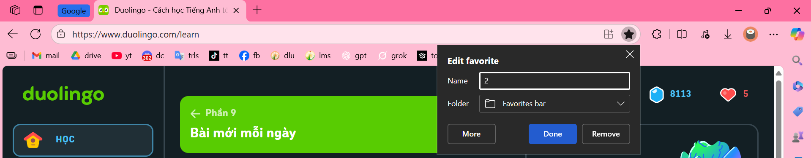

# Chương 1. Nghề làm web

## 1.3. Bài tập và thực hành

### Bài 1. Liệt kê danh sách các ngôn ngữ lập trình, công cụ, kỹ năng, công nghệ mà bạn dự định học để theo nghề làm web.

- Ngôn ngữ lập trình: JavaScript, Python, Java.
- Công cụ: VSCode, GitHub, …
- Kỹ năng: Kiến thức nền về Hệ điều hành, Kỹ thuật lập trình, Cấu trúc dữ liệu và thuật toán, Lập trình hướng đối tượng, Cơ sở dữ liệu; Cơ bản về lập trình front-end và back-end, …

### Bài 2. Tự tạo một danh sách các thuật ngữ tiếng Anh chuyên ngành, kèm theo nghĩa tiếng Việt.

| Vocabulary                          | Nghĩa tiếng Việt                                                                 |
|--------------------------------------|------------------------------------------------------------------------------------|
| HTML (HyperText Markup Language)     | Ngôn ngữ đánh dấu siêu văn bản                                                     |
| CSS (Cascading Style Sheets)         | Bảng định kiểu xếp chồng                                                           |
| JavaScript                           | Ngôn ngữ lập trình kịch bản cho web                                                |
| Responsive Design                    | Thiết kế đáp ứng (tự động điều chỉnh giao diện trên các thiết bị khác nhau)       |
| User Interface (UI)                  | Giao diện người dùng                                                               |
| User Experience (UX)                 | Trải nghiệm người dùng                                                             |
| Wireframe                            | Khung phác thảo giao diện                                                          |
| Prototype                            | Mẫu thử giao diện                                                                  |
| Front-end                            | Phần giao diện người dùng của website                                              |
| Back-end                             | Phần xử lý phía máy chủ của website                                                |
| Framework                            | Khung phát triển ứng dụng                                                          |
| Content Management System (CMS)      | Hệ thống quản lý nội dung                                                          |
| Domain Name                          | Tên miền                                                                           |
| Hosting                              | Dịch vụ lưu trữ website                                                            |
| SEO (Search Engine Optimization)     | Tối ưu hóa công cụ tìm kiếm                                                        |
| Accessibility                        | Khả năng tiếp cận (đảm bảo website phù hợp với mọi đối tượng người dùng, kể cả người khuyết tật) |
| Bootstrap                            | Thư viện CSS phổ biến để thiết kế giao diện nhanh                                 |
| Grid System                          | Hệ thống lưới (định vị bố cục trang web)                                          |
| Media Query                          | Câu truy vấn đa phương tiện (CSS để điều chỉnh giao diện theo thiết bị)           |
| API (Application Programming Interface) | Giao diện lập trình ứng dụng                                                     |
| Debugging                            | Gỡ lỗi                                                                             |
| Cache                                | Bộ nhớ đệm                                                                         |
| Wireframe                            | Bản thiết kế khung sườn giao diện                                                  |
| Viewport                             | Khung nhìn trên trình duyệt                                                        |
| SSL Certificate                      | Chứng chỉ bảo mật SSL                                                              |
| Cross-browser Compatibility          | Tương thích giữa các trình duyệt                                                  |
| Typography                           | Nghệ thuật trình bày chữ viết                                                      |
| Parallax Scrolling                   | Hiệu ứng cuộn thị sai (các lớp nền di chuyển với tốc độ khác nhau)                |
| Favicon                              | Biểu tượng trang web trên tab trình duyệt                                          |
| Sitemap                              | Sơ đồ trang web                                                                    |

### Bài 3. Viết một CV cho bản thân, mục đích để biết bố cục một CV của người làm về công nghệ, biết được mình cần phải làm gì để có các nội dung ghi trong CV.

### Bài 4. Tạo một blog cho bản thân viết về các chủ đề bạn đang theo đuổi, có thể tạo trên blogspot, wordpress, github, hoặc trên các hệ thống khác.

   

# Chương 2. Web là gì?

## 1.4. Bài tập và thực hành

### Bài 1. Tạo liên kết để mở một trang web trên hệ thống web.

[bai_tap1.html](Chuong2/bai_tap1.html)

### Bài 2. Phát triển từ bài tập 1, hãy tạo năm liên kết đến năm trang web mà bạn hay mở mỗi ngày. Thiết lập trang web này là trang mặc định, khi mở trình duyệt.

<em>Thiết lập trang mặc định</em>

  

Kết quả: [bai_tap2.html](Chuong2/bai_tap2.html)

## 1.5. Câu hỏi ôn tập

   

<b>Câu 1. WWW là viết tắt của?</b>  
      

         

A. Wordl Wide Wed  
<mark>B. World Wide Web</mark> 
         

         

C. Word Wide Web  
D. Word Wibe Web 
         

      
  

<b>Câu 2. URL là gì?</b>  
A. Một giao thức trong Internet  
B. Xác định tên của một máy tính trên mạng  
<mark>C. Định vị một tài nguyên cụ thể trên web</mark>  
D. Một chuẩn trong truyền dữ liệu trên web    

<b>Câu 3. The Web is an information system where documents and other web resources are identified by Uniform Resource Locators (URLs, such as https://example.com/), which may be interlinked by ________, and are accessible over the Internet.</b>  
      

 A. URL 

 B. pages 

 C. computers 

 <mark>D. hyperlinks</mark> 

      

   

   

<b>Câu 4. HTML là viết tắt của?</b>  
      

         

A. HyperText Makeup Language  
B. HTTP Technology Model Language 
         

         

<mark>C. HyperText Markup Language</mark>  
D. HyperTest Makeup Language 
         

      
  

<b>Câu 5. Trình duyệt web là một ứng dụng phần mềm để truy cập thông tin trên World Wide Web. Mỗi trang web, hình ảnh và video riêng lẻ được xác định bằng một _________ riêng biệt, cho phép các trình duyệt truy xuất và hiển thị chúng trên thiết bị của người dùng.</b>  
A. công nghệ  
B. mã HTML  
C. liên kết  
<mark>D. URL</mark>  

   

  

Giải thích:  

Câu 1: WWW là từ viết tắt của World Wide Web - Mạng lưới toàn cầu.  

Câu 2: URL là từ viết tắt của Uniform Resource Locator - Bộ định vị tài nguyên thống nhất nôm na là “Địa chỉ của một tài nguyên web”.  

Câu 3: Dịch sang tiếng việt nghĩa là “Web là một hệ thống thông tin nơi mà các tài liệu và các tài nguyên web khác được định danh bằng URL (ví dụ như  https://example.com/),có thể được liên kết với nhau bằng _____,  và có thể truy cập qua internet. Hyperlinks là siêu liên kết - một tham chiếu đến tài liệu hoặc tài nguyên web.  

Câu 4: HTML là từ viết tắt của Hypertext Markup Language - Ngôn ngữ đánh dấu siêu văn bản.

   

# Chương 3. Trình duyệt Web

## Bài tập và thực hành

### Bài 1. Truy cập và sử dụng một số trang web, ghi lại các thông tin được hiển thị trên thanh trạng thái (nằm ở phía dưới cùng của cửa sổ trình duyệt). Mục đích: để giúp bạn quan sát được quá trình lấy mã nguồn trang web từ server về trình duyệt, và quan sát các liên kết có trong một trang web.

<em>Có thể thấy được URL ở góc dưới bên trái khi rê chuột vào chữ “Wikipedia” ở tiêu đề</em>

### Bài 2. Tạo bookmark cho 5 trang web hữu ích đối với bạn.

<em>Thiết lập Bookmark</em>

  

<em>Có thể thấy Bookmark với biểu tượng “cú Duolingo” với tên “2” đã xuất hiện trên Bookmark</em>

### Bài 3. Lưu đoạn mã nguồn của trang web sau vào một tập tin (test.html). Sau đó mở tập tin bằng trình duyệt. Sử dụng tab Elements của Developer tools, chỉ ra mã nguồn HTML, CSS và cây DOM của trang web.

Kết quả: [test.html](Chuong3/test.html)

## Câu hỏi ôn tập

   

<b>Câu 1. Trình duyệt web đầu tiên do ai tạo ra?</b>  
      

         

A. Steve Jobs  
<mark>B. Tim Berners-Lee</mark>
         

         

C. Bill Gates  
D. Chrome 
         

      
  

<b>Câu 2. Có thể sử dụng trình duyệt web để?</b>  
A. Xem nội dung trang web  
B. Hỗ trợ quá trình thiết kế giao diện  
C. Giúp tìm và sửa lỗi trong quá trình phát triển web  
<mark>D. Cả A, B, và C</mark>  
 

<b>Câu 3. A web browser (commonly referred to as a browser or internet browser) is an _________ for accessing the World Wide Web.</b>  
      

         

<mark>A. application software</mark>  
B. operating system
         

         

C. library  
D. framework
         

      
  

   

   

Câu 4. Mã nguồn trang web, khi trình duyệt nhận về từ web server có thể gồm?  
A. HTML, CSS, PHP, JavaScript  
B. HTML, CSS, C#  
C. CSS, C#, SQL  
<mark>D. CSS, JavaScript, HTML</mark>  

Câu 5. Một số kết quả trung gian được tạo ra khi trình duyệt hiển thị trang web là gì?  
A. DOM, CSSOM, Trang web kết quả, HTML  
B. CSS, DOM, Trang web kết quả, DOM Tree  
<mark>C. DOM tree, CSSOM, Trang web kết quả, Render tree</mark>  
D. CSSOM, DOM tree, OOP, Render tree  

Câu 6. CSSOM là viết tắt của?  
A. CSS Object Modern  
B. CSS Oriented Model  
C. CSS Object Mode  
<mark>D. CSS Object Model</mark>  

   

